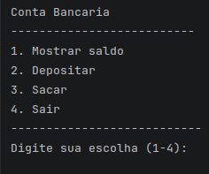

# Sistema de Conta Bancária em Java

## Descrição
Este projeto é um sistema simples de conta bancária desenvolvido em Java, 
executado via terminal. Ele permite ao usuário realizar 
operações básicas como consulta de saldo, 
depósito e saque, utilizando um menu interativo.

O objetivo principal desse projeto é treinar a lógica em programação procedural, permitindo uma compreensão clara do fluxo do programar.

## Funcionalidades
💰 Consultar saldo.   
➕ Realizar depósitos.   
➖ Realizar saques.  
🚪 Encerrar o programa. 

## Como funciona
O sistema apresenta um menu interativo no console:

O usuário escolhe uma opção digitando um número. O programa continua em execução até que a opção 4 (Sair) seja selecionada.

## Regras de Negócio
Depósitos devem ser maiores que zero.  
Saques devem ser maiores que zero.  
Não é permitido sacar valores maiores que o saldo disponível.

## Como executar
- Pré-requisitos  
    Java JDK instalado     

Passos   
- 1 Compile o arquivo:                    
    - javac ContaBancaria.java  
- 2 Execute o programa:   
    - java ContaBancaria  

## Estrutura do Código
- Método   
    main - > Controla o fluxo do programa e o menu   
    mostrarSaldo  - >  Exibe o saldo atual       
    depositar  - >  Recebe e valida o valor do depósito    
    sacar   - >   Realiza validações e executa o saque

## Melhorias Futuras (POO)
Este projeto vai ser evoluido futuramente aplicando conceitos de Programação Orientada a Objetos
